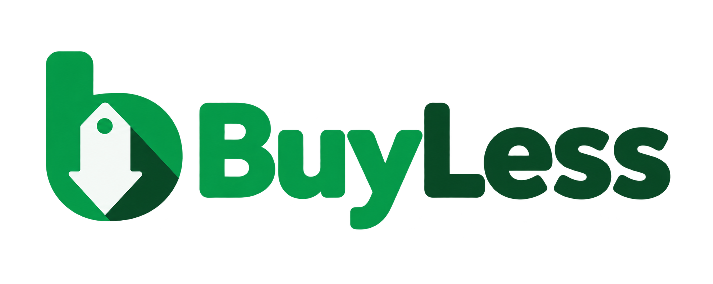
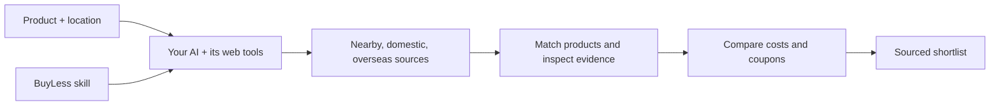

# BuyLess



**Spend less. Know why.**

A shopping research **skill for your AI**. Tell it what you want and where you are. BuyLess guides your assistant through nearby stores, domestic marketplaces, overseas sellers, coupons, and the evidence behind the cheapest comparable options.

**Stop checking stores one by one.** BuyLess makes your AI do that work: find sellers, inspect matching offers, check discounts and reliability, and identify the lowest comparable payable price supported by the research. You receive a purchase recommendation and its evidence, rather than a browsing task list. Cheaper unverified listings are shown separately.

> No BuyLess account. No shared API key. No BuyLess server.
> Your AI uses the search, browser, and reasoning tools already available in its own environment.

## One sentence is enough

> “Find me a Lenovo 11 laptop in Jakarta.”

> “Find the cheapest Sony WH-1000XM5 I can pick up near Manchester.”

> “Compare local and overseas prices for this graphics card, delivered to Singapore.”

Location is required. If it is already in your request or conversation, the skill uses it. Otherwise, your assistant asks one short question. Ambiguous products are researched and separated instead of silently guessed.

Unless you say otherwise, BuyLess assumes one new item, delivery to your city, destination currency, and the destination's local language. It includes observed shipping and known fees, and labels missing shipping instead of guessing. Budget, condition, and pickup radius remain optional.

## What the skill does

- Discovers nearby shops, national retailers, marketplaces and destination-eligible overseas sellers dynamically, without a bundled store list.
- Checks that offers match the model, variant, condition, quantity, and region you need.
- Compares actual payment costs, including known shipping and fees.
- Checks coupons, minimum spend, caps, expiry, and account conditions.
- Keeps cashback and incomplete import estimates separate from money payable today.
- Investigates seller, warranty, and authenticity claims with attributable sources.
- Tracks checked sources, blocked access and unfinished coverage across six research families.
- Applies a stricter evidence gate when original/genuine goods are required; cheaper unverified offers stay separate.
- Returns a concise comparison with the location, timestamps, links, and uncertainties.

The main objective is **the lowest comparable cost among offers actually checked**. A better-reviewed or higher-commission seller does not silently replace that objective.

## Install as a ChatGPT or Codex plugin

The repository includes a skills-only portable plugin under `plugins/buyless` and a repo marketplace at `.agents/plugins/marketplace.json`. The plugin has no BuyLess server, account, or API key; it uses web tools available in the ChatGPT or Codex host.

Add the [public BuyLess repository](https://github.com/alfahricireng12/buyless) as a marketplace source, then install the plugin:

```sh
codex plugin marketplace add alfahricireng12/buyless
codex plugin add buyless@buyless-community
```

For local development, open this repository in the ChatGPT desktop app, restart the app, open **Plugins**, select the **BuyLess Community** marketplace source, and install **BuyLess**. Start a new Chat or Work conversation after installation. Ask naturally or type `@BuyLess` to select it explicitly. Plugin support and available web tools depend on the account, workspace, surface, and selected chat.

The portable bundle is generated from the root skill. After editing runtime instructions, synchronize and validate it:

```sh
python scripts/build_plugin.py
python scripts/validate_repo.py
```

This repository includes the public BuyLess Community marketplace. Universal listing in the public Plugins Directory is a separate process and still requires submission, OpenAI review, and publication. See [public release preparation](docs/publication.md).

## Install as a local skill

BuyLess follows the [Agent Skills directory format](https://agentskills.io/specification). The repository root is the skill folder:

```text
buyless/
├── SKILL.md                  # The instructions your AI loads
├── agents/openai.yaml        # Optional host-specific display metadata
├── references/               # Focused guides loaded when relevant
├── scripts/                 # Optional offline price and evidence-record checks
├── examples/                # Explicitly synthetic observations
└── tests/                   # Tests for the helper
```

Download and extract the repository ZIP, open a terminal in `buyless`, and run the installer with Node.js 20+:

```sh
# Available across local projects for this OS user:
node bin/buyless.mjs init --ai codex --global

# Or choose another host:
node bin/buyless.mjs init --ai claude --global
node bin/buyless.mjs init --ai cursor --global

# Check the installed files:
node bin/buyless.mjs doctor --ai codex --global
```

Choose the command for the host you use. Open a new host session after installation. If BuyLess does not appear in the skill selector, restart the host. Ask naturally, or invoke it explicitly:

```text
Codex:       $buyless I want to buy a Flipper Zero in Miami.
Claude Code: /buyless Find the cheapest headphones in Osaka.
```

For a named command similar to other skill CLIs, optionally install **from this downloaded folder**:

```sh
npm install --global .
buyless init --ai codex --global
buyless doctor --ai codex --global
```

There is no published BuyLess npm package. Do not run an assumed `npx buyless` package. These commands use the local code you downloaded from this repository. The installer has no dependencies, downloads, API calls or install hooks.

For project-only installation, use `--project /path/to/project` instead of `--global`; omit both to use the current folder. Preview changes with `--dry-run`. Existing different files are never overwritten. See [installation details and host compatibility](docs/installation.md).

Automatic activation depends on the host's skill matching and settings. `doctor` verifies files, not live activation or browsing access. Local skill installation does not register the plugin in ChatGPT web/mobile or synchronize other devices. Use the plugin package above on supported ChatGPT surfaces. For hosts without skill discovery, reading `SKILL.md` and its references remains a manual fallback.

**Requirements:** an AI host with web search/page-reading or browser tools for live research. Python 3.11+ is optional and only needed for the offline helpers. Host subscriptions, tool availability, and search usage remain the user's own; BuyLess supplies none of them.

## Try the offline calculator

No API keys, network access, or Python packages are needed:

```sh
python scripts/compare_offers.py examples/offers.synthetic.json --format markdown
```

The fictional example demonstrates:

| Scenario | Expected behavior |
|---|---|
| IDR 4,200,000 with a capped 10% coupon and IDR 25,000 shipping | IDR 3,925,000 payable |
| IDR 100,000 cashback | Displayed separately, not subtracted again |
| A cheaper pickup price | Separate payment-only comparison because travel is unknown |
| An overseas price with unknown fees | No confirmed cheapest-total claim |
| A cheaper wrong variant | Excluded from the requested comparison |

For machine-readable output, use `--format json`. The helper calculates supplied facts; it cannot browse, establish authenticity, or verify a coupon. See [input format](references/offer-format.md) and [synthetic example](examples/README.md).

## International, with local context

**Any country. No hardcoded store list.** The [discovery workflow](references/store-discovery.md) finds shops from the requested product, city and country, using local-language web and place searches. It expands from nearby outlets to nationwide sellers and overseas offers that serve the destination. New countries do not require an adapter or a BuyLess API.

The [international guide](references/international.md) covers languages, currencies, destination charges and regional compatibility. Your assistant checks current access and listing-level delivery. A map listing is not proof of stock. An international storefront is not proof of worldwide shipping.

## Thorough research, visible evidence

The [search protocol](references/search-protocol.md) covers nearby shops, domestic marketplaces, domestic retailers, overseas sellers, promotions and manufacturer evidence. It expands competitive leads, deduplicates repeated listings and records why the search stopped. Thorough does not mean claiming every store was accessible.

The [authenticity protocol](references/authenticity.md) separates exact product identity, manufacturer-backed seller authorization, warranty/returns and individual-unit inspection. Seller claims, ratings and valid serial numbers alone do not establish authenticity. If evidence is insufficient, the assistant explains the gap instead of promising genuine goods.

An optional offline audit checks the structure and completeness of supplied research records:

```sh
python scripts/audit_research.py examples/research.synthetic.json
```

It flags missing source families, mismatched subjects, stale support and contradictory evidence. It does **not** fetch sources, authenticate goods or certify the assistant's claims. Read the [ledger format](references/research-format.md). No extra packages are needed.

## How it works



BuyLess contains operational instructions, focused reference material, a deterministic calculation helper, synthetic examples, regression tests, and behavioral evaluation scenarios. It does not contain a shopping application or backend.

## Honest limits

The skill cannot search every store, guarantee a global minimum, or prove the physical authenticity of goods from online pages. Account-specific vouchers and checkout charges may remain unverified. Without web access, your AI must say that it cannot check current prices.

Buying, reserving, contacting sellers, and scheduling alerts are separate user-authorized actions. The skill does not perform them automatically.

## Contribute

Contribute regional search knowledge, promotion edge cases, better evidence checks, or behavioral evaluations. Read [CONTRIBUTING.md](CONTRIBUTING.md), the [evaluation scenarios](evals/README.md), and [security boundaries](SECURITY.md).

```sh
python scripts/validate_repo.py
python -m unittest discover -s tests -v
node --test tests/installer.test.mjs
```

The included tests verify arithmetic, evidence-record gates and input handling. They are not a benchmark of every AI host or evidence of live marketplace access.

## Status and license

Version 0.5.0: public-distribution metadata, developer identity `devino.als`, one-sentence requests, explicit defaults, automatic research depth, decision-first results, plain evidence labels, a portable ChatGPT/Codex plugin bundle, the offline multi-host installer, dynamic worldwide discovery, and two optional offline helpers. Host behavior and live source access vary. Universal directory availability is claimed only after OpenAI approves and publishes the submission.

[MIT license](LICENSE). Repository content is in English. Shopping reports default to the destination country/region's language; an explicit user language preference overrides that default. Multilingual destinations use local context rather than a fixed country-language list.

\n
